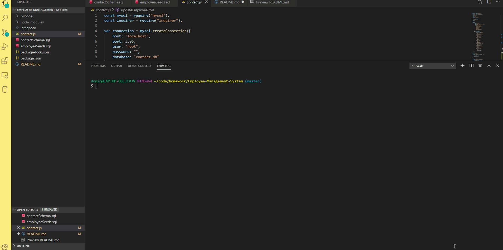
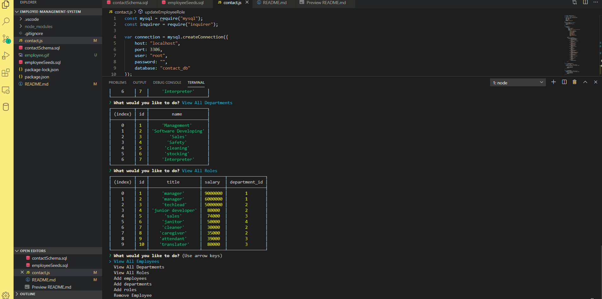
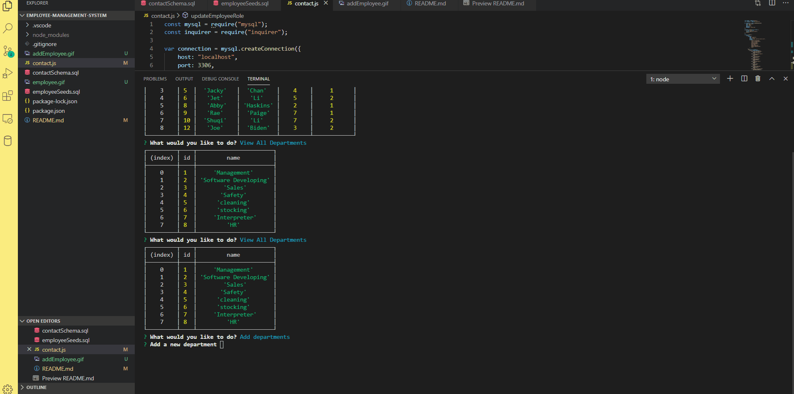
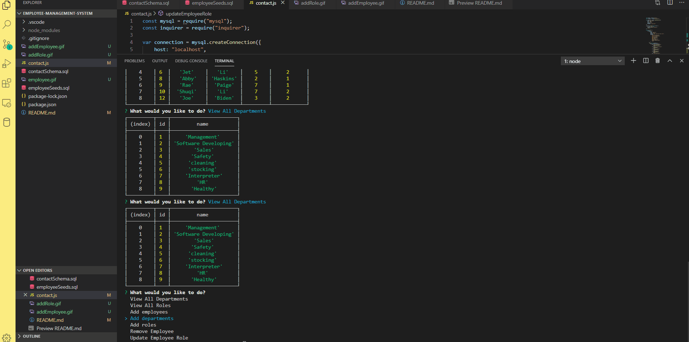

# Employee-Management-System

## Description
This is a Employee management system that allows for the user to create and manage data for the employees and their roles. The application uses a command line interface (CLI) and use inquirer to prompt the user in order to change the mysql database. 
The actions to choose from currently include:

- View all employees, roles and departments in the company. 
- Add an employee to the employee table, add a role to the role table or add a department to the department table.
- Update an employee's role
- Delete an employee

## Contact:
Dominic Xu dominictxu1@gmail.com

## Link to deployed App
[Link to the GitHub page] (https://github.com/lorddominic/Employee-Management-System)

## Gif

